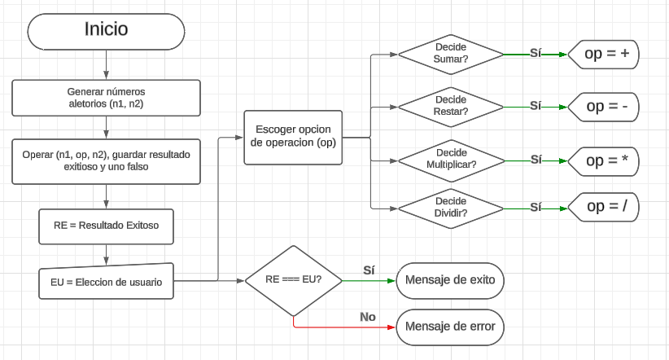
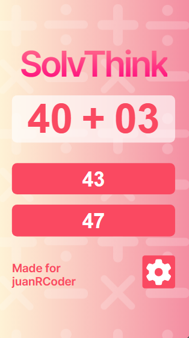
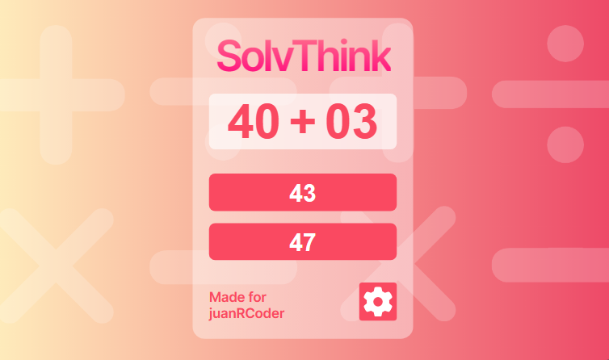

## SolvThink: Resuelve/Piensa rapido

Es un juego de pensamiento rapido, el cual el usuario podra resolver operaciones basicas como sumar, restar, multiplicar y dividir.

### 📌 Proposito:

Lo principal es ayudar al usuario a resolver operaciones matematicas rapidas el cual tiene que resolver al comprar un producto, sacar una cuenta de restaurant, entre otras cosas.

WebSite: [https://solvthink.netlify.app](https://solvthink.netlify.app/)

## 🛠 Tecnologías:

- Este proyecto fue realizado con las siguientes tecnologias y dependencias:
  
  
  
  
  

## 📈 Diagrama de flujo:

- Este es un pequeño diagrama del planteamiento y seguimiento estatico del proyecto.

  

## 📱💻 Diseño responsivo (mobile & tablet):

- Estos son los diferentes vistas para cualquier dispositivo.

   
   

## 🧑 Autor: Juan Ramirez

- Linkedin: [@Juan Ramirez](https://www.linkedin.com/in/juan-ramirez-490b84271/)
- Instagram: [@juanrcoder](https://www.instagram.com/juanrcoder/)

### Proyecto:

- WebSite: [https://solvthink.netlify.app](https://solvthink.netlify.app/)

## Licence:

- Este proyecto está bajo la Licencia MIT - ver el archivo [LICENSE](LICENSE) para más detalles.
